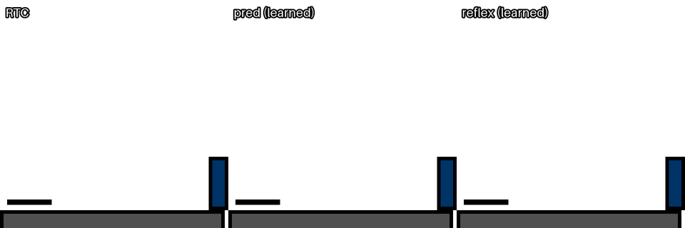

# JIT Reflex: a frozen chunking policy's own Jacobian as a feedback controller between its calls

[](https://doi.org/10.5281/zenodo.22962312)

Large robot policies are too slow to call at control rate, so they emit **action chunks** and the robot replays a stale plan until the next call arrives. This project asks a narrow question: between two calls, can a frozen flow-matching chunking policy be replaced by **its own local linearization** along the predicted trajectory? No training is involved: the gain is the policy's Jacobian, obtained with a few reverse-mode VJPs.



*Illustration, not evidence:* `mjc_swimmer`, d = 3, s = 5, the first of seeds 0–15 where the reflex solves and pred fails (a rule fixed before viewing). Over those 16 seeds RTC, pred and reflex solve 5, 12 and 11, with a locally retrained world model that makes pred stronger here; a 256-episode check with it gives pred 57% and reflex 76% (B1's model: 43% and 71%, [csv](results/demo/wm_check_swimmer.csv)). Over B1's 768 episodes this level gives RTC, pred and reflex 41%, 42% and 71%. It is B1's strongest level for `J`; across all 12 levels the reflex gains +7.7 pp over RTC.

```
a_j = π(z_j, ô_j)[0] + clip( J_j · (o_j − ô_j), ±1 ),     J_j = ∂π(z_j, o)[0] / ∂o  at  o = ô_j
```

Here `ô_j` is the observation predicted at call time for step j, `o_j` is the fresh observation, and `z_j` is the call's flow noise rolled so that row 0 is chunk step j's row. The testbed is Physical Intelligence's [real-time-chunking-kinetix](https://github.com/Physical-Intelligence/real-time-chunking-kinetix): 12 Kinetix 2D-physics levels, public behavior-cloned flow policies, simulated inference delay, and RTC as the strong baseline. **In phase A the predictor is an oracle, a noise-free simulator fork;** phase B1 replaces it with wrong physics and a learned world model.

## Results

The full write-up is [**docs/results/report.md**](docs/results/report.md). Lab notes, in Russian: [E1](docs/results/probe.md), [E2 / Gate 2](docs/results/closed-loop.md), and the [spec with a pre-registration changelog](docs/superpowers/specs/2026-09-23-jit-reflex-phase-a-design.md).

- **Offline:** the tangent recovers about half of a fresh call's correction on all 12 levels. The median ρ is 0.54, and 12/12 levels have ρ ≥ 0.3 ([figure](results/probe_e1b/rho.png)). This holds when actions are compared as the environment executes them. A raw-action comparison said KILL, because of errors in clipped or unused action dimensions.
- **Closed loop** (RTX 4090, 3 seeds × 256 episodes × 12 levels, [figure](results/eval/main/success.png)): with rare policy calls the reflex **beats RTC**, by +9.1 pp over delays 2–4 and +15.6 pp at delay 4. Under random velocity kicks it beats the better of naive and RTC by **+5.3 pp**.
- **But** most of that edge comes from **re-querying the policy at the oracle-predicted state**. `J` itself matters for **rare calls**: +4…+10 pp at execute horizon s ≥ 5, and +6…+8 pp under kicks. That claim was pre-registered and confirmed on held-out seeds, narrowly. The pre-registered **Gate 2 is negative**, because `J` gave 20% of the gain against a 50% bar.
- **Cost:** a reflex call is 525 network evaluations (35× RTC) and takes 2.07× RTC's latency. In the only latency-fair comparison the benchmark allows, the reflex loses.
- **Phase B1** ([report §8](docs/results/report.md#8-phase-b1-stale-plans-and-imperfect-predictors), [figure](results/b1/gpu/b1_ci.png)) replaces the oracle with wrong physics and a learned world model. The pre-registered verdict is **SURVIVES**, narrowly. With the learned model the reflex is nearly as good as with the oracle (within 0.2–1.5 pp), and **all of its gain over RTC appears only when `J` is switched on**: on d = 3, s = 5, `pred` gives 0.0 pp and reflex +7.7 pp. `J`'s effect grows with both staleness and prediction error. Latency is still 1.8–1.9× RTC.
- **Next:** the dated research agenda with predictions and kill criteria is in [docs/roadmap.md](docs/roadmap.md).
- **Demo:** [results/demo/a.mp4](results/demo/a.mp4) is the clip above with its full caption. [b.mp4](results/demo/b.mp4) is the same level with 20% wrong physics instead of the learned model: seed 1, and over 16 seeds pred and reflex solve 7 and 10 (B1: 44% and 68%). [c.mp4](results/demo/c.mp4) is the counterpart where the reflex loses: `catapult`, B1's worst level for it against RTC, seed 4, and over 16 seeds RTC and reflex solve 6 and 4 (B1: 41% and 30%). The older [results/video_kick.mp4](results/video_kick.mp4) shows naive, RTC and reflex side by side on `mjc_walker` with d = 2, s = 6 and kicks c = 1, from the same start with the same noise and kicks. The episode was *selected* as one where only the reflex reaches the goal. Across 16 such episodes, naive, RTC and reflex solve 1, 3 and 6. It is an illustration, not evidence. It was rendered at commit `f9be043`; later exact-speedup commits change float rounding, and this chaotic episode diverges after about 25 steps.

## Reproduce on a Mac (CPU, offline after setup)

```bash
uv sync                      # CPU JAX on macOS; the lock also carries CUDA JAX for Linux
mkdir -p checkpoints/bc/31/policies
for L in grasp_easy catapult cartpole_thrust hard_lunar_lander mjc_half_cheetah mjc_swimmer mjc_walker h17_unicycle chain_lander catcher_v3 trampoline car_launch; do
  curl -fsSL -o checkpoints/bc/31/policies/worlds_l_$L.pkl https://storage.googleapis.com/rtc-assets/bc/31/policies/worlds_l_$L.pkl
done
uv run pytest -q             # 39 tests
./scripts/run_e1.sh          # E1, ~20 min: results/probe/
./scripts/run_e1b.sh         # E1b, ~20 min: results/probe_e1b/
./scripts/run_e2_preview.sh  # small closed-loop preview, ~1 h
uv run python scripts/check_upstream_bitwise.py   # upstream methods are bit-identical to PI's code
uv run src/video.py demo --preset a --gif-width 960   # also b, c: results/demo/
uv run src/video.py kick --seed 0 --out results/video_kick.mp4   # E4 clip, bit-exact at f9be043
```

## Reproduce on a GPU (E2, ~13 h on one RTX 4090)

Copy the code to a Linux host with an NVIDIA GPU (≥ 24 GB). The host downloads Kinetix, packages and checkpoints itself:

```bash
git archive --format=tar.gz -o /tmp/m2r.tgz HEAD && scp /tmp/m2r.tgz user@host:
# on the host:
mkdir m2r && tar xzf m2r.tgz -C m2r && cd m2r && tmux new -s e2 './scripts/gpu_e2.sh 2>&1 | tee e2.log'
```

Then fetch `e2_results.tgz` and run `uv run src/plot.py gate2` and `uv run src/plot.py success`.

## Structure

| path | what |
|---|---|
| `src/reflex.py` | the method: shifted noise, policy Jacobian, predicted rollout, reflex package, clipped correction, cost model |
| `src/probe.py` | E1 offline kill-test (`run`), per-call cost (`cost`), kick calibration (`kick-speed`) |
| `src/eval_flow.py` | upstream closed-loop eval plus the `pred` / `reflex` / `reflex_chunk` / `rtc_reflex` methods, kicks and CLI filters |
| `src/train_expert.py` | upstream, plus `KickWrapper` |
| `src/model.py` | upstream `FlowPolicy`, plus `action_from_noise` |
| `src/plot.py`, `src/video.py` | figures, tables, the Gate 2 check, the demo videos |
| `tests/test_reflex.py` | unit tests (Jacobian vs finite differences, package alignment, verdict rules, env action mapping) |
| `scripts/` | offline Mac runners, the GPU runner, and the upstream bitwise check |
| `results/` | raw CSVs, figures and the video for every run in the report |

## Based on

- [real-time-chunking-kinetix](https://github.com/Physical-Intelligence/real-time-chunking-kinetix) (Physical Intelligence, MIT). The original README is in [README.upstream.md](README.upstream.md).
- [Kinetix](https://github.com/FLAIROx/Kinetix) and Jax2D.
- Related work discussed in the report: A2C2, VLASH, Pace-and-Path, VLA-Feedback, [bt-kinetix](https://github.com/TheAyos/bt-kinetix).
