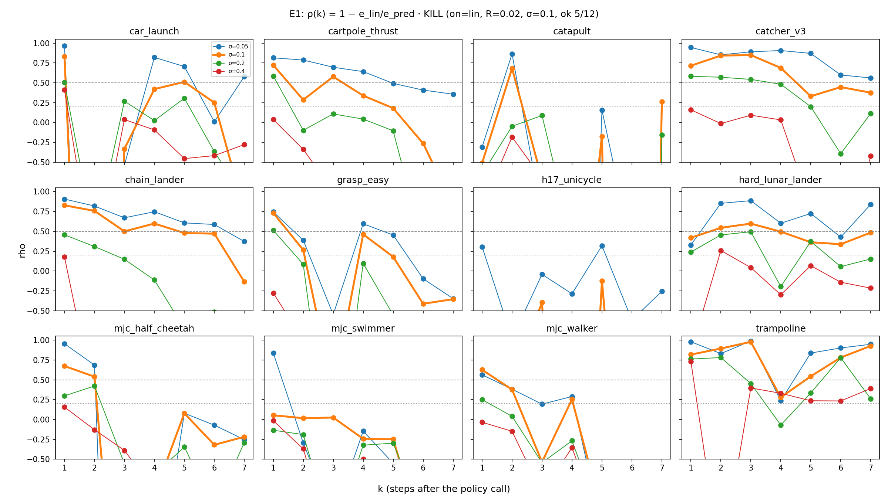
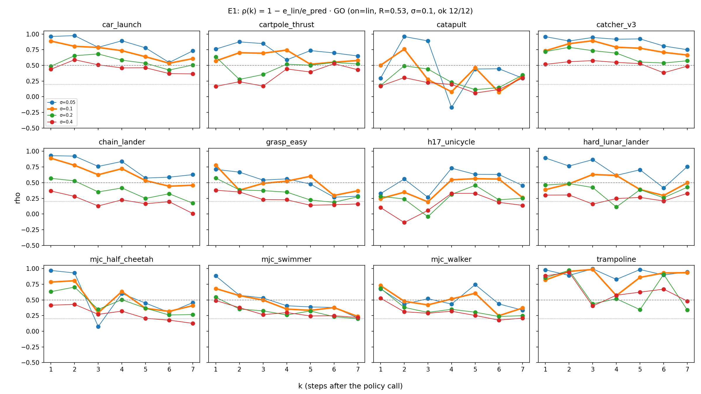

# E1: kill-test локальной линейности — итог и Gate 1

**Решение Gate 1: GO → E2** (по заранее зафиксированному E1b):

```json
{
  "verdict": "GO",
  "on": "lin_clip",
  "sigma": 0.1,
  "R": 0.5417958052830165,
  "levels_ok": 12,
  "levels": 12,
  "rel": 0.23530536822435577
}
```

Первый, заранее зарегистрированный E1 дал **KILL**:

```json
{
  "verdict": "KILL",
  "sigma": 0.1,
  "R": 0.019435141376494602,
  "levels_ok": 5,
  "levels": 12,
  "rel": 0.2264527796975994
}
```

## Что проверяли

Для каждого из 12 уровней Kinetix проверяли, насколько касательная к замороженной policy воспроизводит свежий вызов:

1. Взяли 256 состояний из 64 шумных rollout'ов naive (`s = 4`).
2. В каждом состоянии чанк `A = π(z, o_t)` прогнали дважды: без шума, получив предсказание `ô`, и с шумом действий `σ`, получив реальное `o`.
3. Сравнили три варианта:
   - `ã = π(roll(z,−k), ô)[0]` — переспросить policy в предсказанной точке;
   - `ã + J·(o − ô)` — касательная;
   - свежий вызов `a* = π(roll(z,−k), o)[0]`.

`ρ = 1 − ē_lin / ē_pred` — доля «поправки на отклонение», которую возвращает `J`. Для каждого уровня ошибки суммируются по `k = 1…4` при `σ = 0.1`. Параметры: `N = 256`, `M = 4`, `σ ∈ {0.05, 0.1, 0.2, 0.4}`, `k = 1…7`, 5 шагов flow. Команды: `./scripts/run_e1.sh` (E1), `./scripts/run_e1b.sh` (E1b), `OUT=results/probe_e1_exec ./scripts/run_e1.sh --action-space executed --verdict-on lin` (проверка на seed 0). Каждая занимает около 20 минут на Mac M1 Max (CPU).

## Цепочка E1 → E1b → проверка на seed 0

| уровень | E1: сырые действия, seed 0 | проверка: исполняемые, seed 0 | E1b: исполняемые, обрезка ±1, seed 1000 |
|---|---|---|---|
| h17_unicycle | -2.93 | 0.34 | 0.39 |
| car_launch | -1.96 | 0.78 | 0.75 |
| catapult | -1.71 | 0.38 | 0.52 |
| mjc_half_cheetah | -1.62 | 0.55 | 0.65 |
| grasp_easy | -0.35 | 0.49 | 0.56 |
| mjc_swimmer | -0.10 | 0.45 | 0.43 |
| mjc_walker | 0.14 | 0.51 | 0.52 |
| cartpole_thrust | 0.45 | 0.71 | 0.41 |
| hard_lunar_lander | 0.51 | 0.52 | 0.52 |
| chain_lander | 0.62 | 0.71 | 0.56 |
| trampoline | 0.65 | 0.78 | 0.83 |
| catcher_v3 | 0.77 | 0.82 | 0.83 |
| **медиана R** | **0.02** | **0.53** | **0.54** |
| **уровней с ρ ≥ 0.3** | **5/12** | **12/12** | **12/12** |

Картинки ρ(k), по уровням и по σ:

- E1: 
- E1b: 
- проверка на seed 0: 

## Выводы

1. **Касательная возвращает примерно половину поправки на всех 12 уровнях**, если сравнивать действия так, как их исполняет игра. В E1b медиана `R = 0.54`, у всех уровней `ρ ≥ 0.3`. Лучшие уровни — `catcher_v3` и `trampoline` (0.83), слабее всех `h17_unicycle` (0.39) и `mjc_swimmer` (0.43).
2. **KILL в E1 — артефакт пространства сравнения.** На тех же состояниях (seed 0) в сыром пространстве действий ρ лежит от −2.9 до 0.77, в исполняемом — от 0.34 до 0.82. В сыром пространстве касательная «перелетала» за пределы моторов, например 3.0 вместо 1.2, хотя игра обрезает оба значения до 1. Кроме того, она ошибалась в размерностях, которые ничем не управляют. Физически это не ошибки. Методический урок: в управлении сравнивать нужно то, что реально исполняется. Обрезка коррекции ±1 почти ничего не добавила: `rho` и `rho_clip` почти равны. Новый seed тоже: 0.53 против 0.54.
3. **Разведка до E1b показала структуру ошибок** (4 уровня, свои ключи, см. журнал спека). В типичном состоянии касательная почти точна: медианное ρ ≈ 1, и в 87–97% замеров `J` помогает. Среднюю ошибку в сыром пространстве определял худший 1% замеров: на него приходилось 50–100% всей ошибки.
4. **ρ убывает с ростом отклонения и горизонта, как и положено касательной.** Медиана по уровням в E1b по `σ`: 0.65 / 0.54 / 0.41 / 0.31 при `σ` = 0.05 / 0.1 / 0.2 / 0.4. По `k` при `σ = 0.1`: 0.76 (k=1) → 0.49 (k=4) → 0.47 (k=7).
5. **Главная оговорка для E2: несогласованность самого плана больше, чем влияние отклонений.** При `σ = 0.1`, `k = 1…4` средние такие:
   - `ē_floor = ‖A[k] − ã_k‖² ≈ 0.19` — план против переспроса в предсказанной точке, без всяких отклонений;
   - `ē_pred ≈ 0.04` — сколько добавляет отклонение;
   - `ē_chunk ≈ 0.19`.

   Выходит, «спросить policy заново» и «доиграть старый план» расходятся даже в спокойном мире. Это верно и со сдвинутым шумом: план немного спорит сам с собой. Отсюда следствие для E2: главный выигрыш может дать переспрос в предсказанной точке (`pred`, аналог VLASH), а вклад `J` будет примерно половиной от оставшихся ~20%. Поэтому абляция `pred` в E2 и условие Gate 2 «`reflex − pred ≥ 0.5 × (reflex − naive)`» критичны. Это ожидание записано до E2.
6. **Релевантность.** `rel = ē_pred / ē_chunk ≈ 0.23` при `σ = 0.1`, это выше порога 0.1, поэтому основным остаётся `σ = 0.1`.

## Честность процедуры

- Первый вердикт (KILL) не переписан. E1b и его правило записаны в спек до прогона: сравнение исполняемых действий, обрезка ±1, свежий seed 1000, прежние пороги.
- Выбор пространства сравнения сделан после провала E1. Его оправдание — устройство самой игры (`convert_continuous_actions`), а не результат. Скептик вправе засчитать это как вторую попытку. Окончательный ответ даст замкнутый цикл E2.
- Предсказатель в E1 — оракул, то есть форк симулятора без шума. Один seed на прогон.
