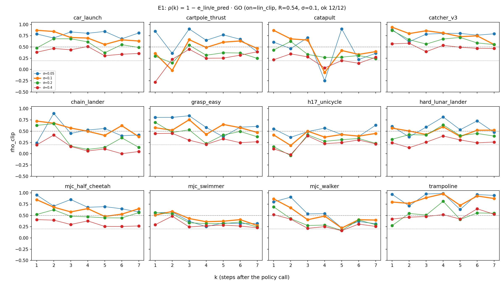
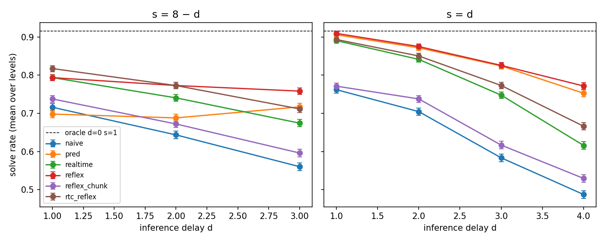
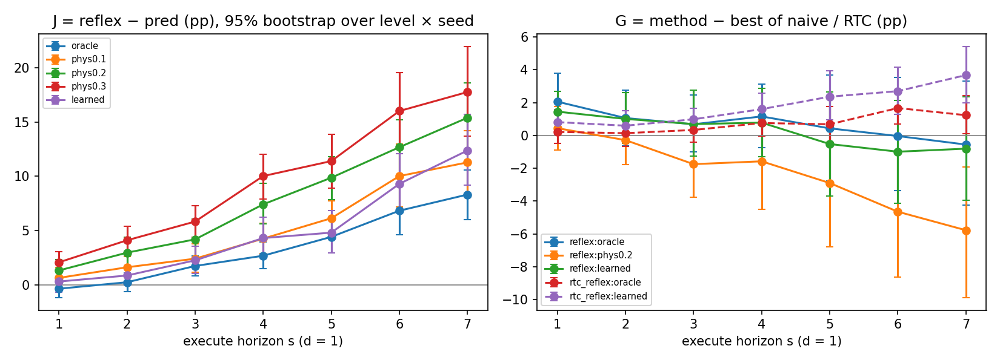

# JIT Reflex: linearizing a frozen action-chunking policy between its calls

*Aleksandr Karpov · Phase A report, with phase B1 in [§8](#8-phase-b1-stale-plans-and-imperfect-predictors) · Kinetix (12 levels) · September 2026. Lab notes in Russian: [E1 memo](probe.md), [E2 / Gate 2 memo](closed-loop.md), [B1 memo](b1.md), and the [design spec](../superpowers/specs/2026-09-23-jit-reflex-phase-a-design.md) with its changelog.*

## TL;DR

- **Idea.** A frozen chunking policy (flow matching, chunks of H = 8 actions) is slow to call, so between calls the robot replays a stale plan. The reflex instead acts on the policy's own **local linearization** along the predicted trajectory: `a = π(ô)[0] + clip(J·(o − ô))`. The Jacobian `J` comes from reverse-mode autodiff, and no training is involved.
- **Offline (E1).** The tangent recovers about **half** of what a fresh policy call would change, on **all 12** levels (median ρ = 0.54). This holds once actions are compared the way the environment executes them. A raw-action comparison said KILL, and we traced that to errors in clipped or unused action dimensions.
- **Closed loop (E2):** 3 seeds × 256 episodes × 12 levels on an RTX 4090.
  - With rare calls the reflex **beats Real-Time Chunking (RTC)**: +9.1 pp over delays d = 2…4, and +15.6 pp at d = 4.
  - Under random velocity kicks it beats the better of naive and RTC by **+5.3 pp**.
- **But** most of that advantage comes from **re-querying the policy at the oracle-predicted state**, not from `J`. `J`'s own niche is **rare calls**: +4…+10 pp at s ≥ 5, and +6…+8 pp under kicks. This niche was pre-registered and confirmed on held-out seeds, though only narrowly.
- **The pre-registered Gate 2 is NEGATIVE:** `J` accounted for 20% of the gain, and the bar was 50%. The pre-registered **RTC + reflex** combination also missed its bar.
- **Cost.** A reflex call is 525 network evaluations, 35× RTC, and has **2.07× RTC latency**. In the only latency-fair comparison the benchmark allows (d = 1), the reflex loses.
- **Phase B1 (§8)** replaced the oracle with wrong physics and a learned world model. The pre-registered verdict is SURVIVES, narrowly. With the learned model, reflex ≈ oracle reflex, and all of its gain over RTC appears only when `J` is switched on. Latency is still 1.8–1.9× RTC.

## 1. Hypothesis

Between two calls of a frozen chunking policy, the policy can be replaced by its own linearization along the predicted trajectory:

```
a_j = π(z_j, ô_j)[0] + clip( J_j · (o_j − ô_j), ±1 ),     J_j = ∂π(z_j, o)[0] / ∂o  at  o = ô_j
```

- `ô_j` is the observation predicted for step j at call time.
- `o_j` is the fresh observation.
- `z_j = roll(z, −j)` is the call's sampling noise, shifted so that its row 0 is the row chunk step j came from (see §3).

The idea is a "reflex": it reacts at the very next control step and needs no training. The closest prior work either trains a corrector (A2C2), uses geometric gains (Pace-and-Path), or trains a local predictor (VLA-ULAP). Taking `K` from the policy's own Jacobian was, to our knowledge, untested.

## 2. Setup and method

- **Benchmark.** [real-time-chunking-kinetix](https://github.com/Physical-Intelligence/real-time-chunking-kinetix) (Physical Intelligence): 12 Kinetix 2D-physics levels, public behavior-cloned flow policies, and Gaussian action noise σ = 0.1. The loop simulates an inference delay `d` and an execute horizon `s`. Baselines are **naive** chunking and **RTC**.
- **Predictor.** A noise-free fork of the simulator, which is an **oracle**. The plan executed over the next H steps is rolled out in this fork.
- **Per call.** The reflex computes the chunk plus, for every chunk index, `ã_j` and `J_j`. Each `J_j` takes 6 VJPs, one per action dimension, versus hundreds of JVPs for the observation dimensions.
- **Variants (ablations):**

| variant | nominal action | feedback |
|---|---|---|
| `pred` | `ã_j` | none (a training-free, oracle VLASH-like re-query) |
| `reflex` | `ã_j` | `J_j` |
| `reflex_chunk` | stale chunk action | `J_j` |
| `rtc_reflex` | RTC chunk | `J_j` |

- **Guards.** A zero-noise invariant check: `reflex_chunk` reproduces `naive` when the prediction is exact. Two bitwise checks: `reflex_off` reproduces `naive`, and `rtc_reflex_off` reproduces RTC. The upstream methods are bit-identical to Physical Intelligence's code (`scripts/check_upstream_bitwise.py`).

## 3. E1: offline kill-test (Mac CPU)

For 256 sampled states per level, a chunk is rolled out twice from each state: noise-free, giving `ô`, and with action noise σ, giving `o`. Two candidates are compared against the oracle `a* = π(z_k, o)[0]`, i.e. what a fresh call would do: the re-query `ã_k` and the tangent `ã_k + J·(o − ô)`. The statistic is `ρ = 1 − e_lin / e_pred`, the share of the "fresh call" correction that `J` recovers. It is pooled over k = 1…4 at σ = 0.1.

| run | seed | action space | median ρ (R) | levels with ρ ≥ 0.3 | verdict |
|---|---|---|---|---|---|
| E1 (pre-registered) | 0 | raw | 0.02 | 5/12 | KILL |
| sensitivity check | 0 | as executed by Kinetix | 0.53 | 12/12 | — |
| **E1b** (pre-registered after E1) | 1000 | as executed, correction clipped ±1 | **0.54** | **12/12** | **GO** |



What we learned:

1. **Compare what is executed.** Kinetix clips motors to [−1, 1] and thrusters to [0, 1], and ignores action dimensions bound to nothing. In raw space the tangent "overshot" in exactly those directions. For example, it predicted 3.0 where the truth was 1.2, but both execute as 1. On the same states, ρ moved from −2.9…0.77 in raw space to 0.34…0.82 as executed.
2. **The tangent behaves like a tangent.** ρ falls with the deviation size (0.65 / 0.54 / 0.41 / 0.31 at σ = 0.05 / 0.1 / 0.2 / 0.4) and with the step offset k. The typical sample is almost exact (median ρ ≈ 1), and the mean is dominated by rare contact events.
3. **Re-asking the policy is not the same as continuing its plan.** Even with correctly shifted noise and no disturbance, `‖A[k] − ã_k‖² ≈ 0.19`, about 5× the effect of the deviation itself. This was an early hint that the re-query alone would carry much of the benefit.

## 4. E2: closed loop (RTX 4090)

Solve rates in %, averaged over 12 levels and 3 seeds (256 episodes each). Calling the policy every step with no delay reaches 91.6%.

| d, s | naive | pred | RTC | **reflex** | `J` (reflex − pred) | reflex − RTC |
|---|---|---|---|---|---|---|
| 1, 1 | 76.2 | 90.6 | 89.1 | 90.9 | +0.4 | +1.9 |
| 1, 7 | 71.6 | 69.8 | 79.4 | 79.4 | **+9.5** | 0.0 |
| 2, 2 | 70.5 | 87.2 | 84.1 | 87.5 | +0.3 | +3.4 |
| 2, 6 | 64.4 | 68.8 | 74.1 | 77.3 | **+8.5** | +3.2 |
| 3, 3 | 58.4 | 82.4 | 74.8 | 82.6 | +0.2 | +7.8 |
| 3, 5 | 56.0 | 71.7 | 67.4 | 75.8 | **+4.1** | +8.4 |
| 4, 4 | 48.8 | 75.3 | 61.6 | 77.2 | +1.9 | **+15.6** |



**Random kicks** (d = 2; every step with p = 0.02, add N(0, (c·v_med)²) velocity to all dynamic bodies):

| c | s | naive | pred | RTC | **reflex** | `J` | reflex − max(naive, RTC) |
|---|---|---|---|---|---|---|---|
| 0.5 | 2 / 6 | 64.4 / 55.5 | 79.0 / 61.4 | 75.2 / 63.7 | 79.8 / 69.8 | +0.8 / +8.4 | +4.6 / +6.2 |
| 1 | 2 / 6 | 58.9 / 51.3 | 72.6 / 57.0 | 67.4 / 57.6 | 73.1 / 64.0 | +0.4 / +7.0 | +5.6 / +6.3 |
| 2 | 2 / 6 | 52.3 / 47.4 | 62.0 / 50.8 | 59.0 / 51.9 | 62.7 / 57.0 | +0.7 / +6.2 | +3.8 / +5.0 |

**Pre-registered decisions:**

| check | result | |
|---|---|---|
| (a) reflex beats RTC at s = 8−d, d = 2…4, by ≥ 5 pp and in every seed | +9.1 pp, 3/3 seeds | ✅ |
| (b) reflex at s = 8−d within 2 pp of RTC at s = d, i.e. ~4× fewer calls | −5.2 pp | ❌ |
| (c) under kicks, reflex beats max(naive, RTC) by ≥ 5 pp | +5.3 pp | ✅ |
| mandatory: `J` gives ≥ 50% of reflex − naive over the grid | 20% | ❌ |
| **Gate 2** | | **NEGATIVE** |
| E2c (registered on seed 0, tested on seeds 1–2): `J` gives ≥ 50% at s ≥ 5 | 0.53 and 0.57 | ✅ (narrow) |
| E2b: RTC + reflex beats RTC by ≥ 3 pp, in every seed | +2.6 pp | ❌ |

**Where it helps and where it hurts.** The reflex gains most on smooth locomotion and control levels (swimmer and walker, +21…+40 pp over RTC; cartpole; lunar lander). It loses on impact-driven and unstable levels (catapult −11…−13 pp; unicycle −18 pp at d = 2), which are the same levels with the lowest ρ in E1. `J` on top of a stale chunk (`reflex_chunk`) barely helps (+1…+4 pp over naive): the re-query and the feedback work as a pair. The same explains why RTC + reflex falls behind plain reflex.

**Cost.** Per call, the reflex costs 525 network evaluations against 15 for RTC, and 12.7× the work per episode at the (b) comparison. On an RTX 4090 at batch 1 it takes 3.42 ms against 1.65 ms for RTC, so r = 2.07. With latency counted fairly, the reflex's delay becomes `⌈2.07·d⌉`. That is feasible within H = 8 only for d = 1, and there the reflex loses: 75.8 vs 79.4 at s = 8−d, and 82.6 vs 89.1 at s = d. The re-query `pred` has r = 1.07, so its advantage at equal d is latency-fair, but it rests on the oracle predictor.

## 5. How the study was run

Every decision rule was written into the spec before its data existed, and commit timestamps show the order. When a measurement bug or a better metric appeared, the old verdict was kept and the new test was registered *before* running it, on a fresh seed:

- E1 → E1b;
- E2b before any `rtc_reflex` run;
- E2c before seeds 1–2.

Exploratory runs on the Mac (a mini-E2 and an overnight run with kicks and large delay) are labelled as such. They were used only to decide what to spend GPU money on (≈ $10).

## 6. Limitations

- **The predictor is an oracle** (a noise-free simulator fork). At large delays, most of the reflex's edge over RTC comes from knowing the future state. A real robot needs a learned predictor, and that is the main open risk. B1 (§8) tests it.
- **Kinetix is not a VLA.** Observations are symbolic, not images. There is one checkpoint set and one action-noise level.
- **E1 used one seed per run**, with 256 states × 4 draws per level.
- **The implementation over-computes.** The reflex package computes Jacobians at all 8 chunk positions, but only `s` of them are used, so the cost and latency numbers are upper bounds. B1 removed this (§8.6).

## 7. What next

Phase B is the natural next step, before any hardware (phase C). It has three parts:

1. Replace the oracle with a **learned predictor**, and check whether the re-query and `J` survive prediction error.
2. Move to a real VLA action head (π0-style action expert), where the observation Jacobian passes only through the small action expert.
3. Make the package cheap: only the `s` used positions, and a trust-region gate that falls back to re-planning near contacts, where the tangent breaks down.

The measured niche (rare calls, disturbances, smooth dynamics) says where such a reflex could pay off. Two examples: a cloud-hosted VLA called a few times per second, or a slow model on a fast, smooth manipulator.

The full agenda, with predictions and kill criteria written before any of it was run, is in [roadmap.md](../roadmap.md).

## 8. Phase B1: stale plans and imperfect predictors

*2026-09-26. The decision rules were written before the data, in the [B1 spec](../superpowers/specs/2026-09-25-b1-staleness-predictors-design.md), §5 (Russian). Russian lab note: [b1.md](b1.md). Data: `results/b1/gpu/`. The run used an RTX 4090 with seeds 10–12 × 256 episodes × 12 levels, 116 configurations.*

**Question.** In phase A, the closed-loop edge rested on an oracle predictor. B1 asks two things. Does `J`'s contribution grow as the plan gets staler? And does the effect survive when `ô` comes from an imperfect predictor?

**Predictors:**
- `oracle`: phase A's noise-free simulator fork.
- `physP`, with P = 0.1, 0.2 or 0.3: the same simulator with every mass, inertia, friction, motor and thruster parameter multiplied by 1 ± P. The sign is random for each parameter, and every method gets the same draw, so comparisons are paired.
- `learned`: a small per-level MLP world model that predicts the change in the 13–49 moving features (out of 679). It is trained on separate naive rollouts on a Mac CPU.

The step-4 prediction error was measured in units of the deviation that action noise alone produces, as a median over levels. It came out as phys0.1 1.39, phys0.2 2.15, phys0.3 3.08 and learned 3.05.

**Setup:**
- Delay d = 1 with s = 1…7, and d = 3 with s = 5.
- Methods: naive, RTC, `pred`, reflex and `rtc_reflex`. `pred` re-queries the policy at the predicted state without `J`; `rtc_reflex` adds the `J` correction to RTC's chunk.
- The package now computes only the s executed positions. This exact speedup reproduced phase A episode for episode.

**Metrics:**
- `G` is a method's solve rate minus the better of naive and RTC.
- `J` = reflex − pred is the **closed-loop ablation effect** of switching the correction on over the re-query. It is not a share of the success.
- Brackets give 95% bootstrap intervals over the 36 level × seed cells, because episodes within a cell are not independent. The intervals are for reporting only; the decision rules do not use them.

### 8.1 Verdict

The verdict is decided on two rare-call slices: D1 (d = 1, s = 5–7) and D3 (d = 3, s = 5). A predictor PASSes a slice if reflex or `rtc_reflex` gets a pooled `G` of at least +1 pp and is above 0 in every seed.

| pre-registered rule | result | |
|---|---|---|
| R1: does the effect survive 20% physics error? | D3: reflex +3.3 pp, all 3 seeds > 0 → PASS; D1: FAIL | **SURVIVES** |
| R2: does `J` grow with staleness? (oracle; mean over s ≥ 5 minus mean over s ≤ 3) | +6.0 pp, > 0 in every seed | confirmed |
| R3: does `J` grow with prediction error? (phys0.2 minus oracle, mean over s) | +4.3 pp, > 0 in every seed | confirmed |
| R4: is the learned model good enough? (same slice test as R1) | PASS on both slices | **ENOUGH** |
| prediction: `rtc_reflex` degrades more than reflex under prediction error | the opposite | not borne out |

**Caveat.** SURVIVES follows the written rule, but only barely. The interval for that D3 phys0.2 gain is +3.3 (−1.9, +8.6), so it contains zero once variation across levels is counted.

### 8.2 Slices

| slice | predictor | reflex `G` | `rtc_reflex` `G` | status |
|---|---|---|---|---|
| d = 1, s = 5…7 | oracle | −0.1 (−3.3, +3.3) | **+1.2 (+0.4, +2.0)** | PASS |
| | phys0.2 | −4.4 (−8.2, −0.9) | −0.1 (−1.4, +1.2) | FAIL |
| | learned | −0.8 (−3.8, +2.2) | **+2.9 (+1.6, +4.4)** | PASS |
| d = 3, s = 5 | oracle | **+9.3 (+4.1, +14.6)** | +3.8 (+1.2, +6.5) | PASS |
| | phys0.2 | **+3.3 (−1.9, +8.6)** | +0.4 (−3.1, +4.1) | PASS |
| | learned | **+7.7 (+3.2, +12.6)** | +6.1 (+3.1, +9.5) | PASS |

- **d = 3 reproduces phase A on fresh seeds.** Reflex, RTC and `pred` solve 76.7, 67.4 and 71.1%; phase A had 75.8, 67.4 and 71.7%.
- **At d = 1 the reflex does not beat RTC, even with the oracle:** −0.1 (−3.3, +3.3). Only `rtc_reflex` keeps a small, consistent edge. When calls are frequent, RTC already does almost everything.

### 8.3 A learned world model plus `J` is close to the oracle

This table gives learned model minus oracle, for the same method:

| where | `pred` (no `J`) | reflex (with `J`) | `rtc_reflex` |
|---|---|---|---|
| d = 1, s = 7 | −4.3 (−6.9, −2.0) | **−0.2 (−1.6, +1.2)** | +2.4 (+1.1, +3.8) |
| D1 slice | −3.0 (−4.8, −1.3) | **−0.7 (−1.6, +0.2)** | +1.7 (+0.9, +2.6) |
| D3 slice | −3.6 (−6.5, −0.9) | **−1.5 (−3.5, +0.2)** | +2.4 (+1.0, +3.9) |

Re-querying at the model's predicted state is 3–4 pp worse than at the oracle's, and the intervals exclude zero. With `J` switched on, the gap shrinks: from 4.3 to 0.2 pp at d = 1, s = 7, and from 3.6 to 1.5 pp on D3. Those intervals include zero.

### 8.4 Ablation: where the gain comes from

- **D3 with the learned model:** `pred` has `G` = 0.0 (−3.7, +4.0), while reflex has +7.7 (+3.2, +12.6). With a learned predictor, **all of the gain over RTC appears only when `J` is switched on**.
- **D3 with the oracle:** `pred` has +3.6 (−0.7, +8.1) and reflex +9.3. With a perfect prediction the re-query helps on its own; with a realistic one it does not.

The next table shows the closed-loop ablation effect of `J` (reflex − pred) at d = 1, in pp. The last two columns carry intervals.

| predictor \ s | 1 | 2 | 3 | 4 | 5 | 6 | 7 | s = 7 interval | D1 slice |
|---|---|---|---|---|---|---|---|---|---|
| oracle | −0.4 | 0.2 | 1.7 | 2.7 | 4.4 | 6.8 | 8.3 | (6.0, 10.6) | 6.5 (4.8, 8.2) |
| phys0.1 | 0.6 | 1.6 | 2.4 | 4.3 | 6.1 | 10.0 | 11.3 | (8.3, 14.2) | 9.1 (6.9, 11.3) |
| phys0.2 | 1.3 | 3.0 | 4.2 | 7.4 | 9.9 | 12.7 | 15.4 | (12.3, 18.6) | 12.6 (10.2, 14.9) |
| phys0.3 | 2.1 | 4.1 | 5.8 | 10.0 | 11.4 | 16.0 | 17.8 | (13.7, 22.0) | 15.0 (11.8, 18.3) |
| learned | 0.3 | 0.9 | 2.3 | 4.3 | 4.8 | 9.3 | 12.4 | (9.2, 15.7) | 8.8 (6.5, 11.3) |

- **Across a row**, the effect grows with staleness (R2): it is near zero at s = 1 and well clear of zero at s = 7.
- **Down a column**, it grows with physics error (R3), a dose–response pattern. So the correction repairs prediction error as well as action noise.
- **But the re-query loses more than `J` restores.** At s = 7, `pred` falls from 70.4% with the oracle to 58.1% with phys0.2; reflex falls only from 78.7% to 73.5%.



### 8.5 The `rtc_reflex` prediction, and an open puzzle

- **Pre-registered reasoning.** Reflex cancels prediction error to first order, since `π(ô) + J·(o − ô) ≈ π(o)`. In `rtc_reflex`, a wrong `ô` adds a spurious correction. So `rtc_reflex` should degrade more.
- **Observed.** From oracle to phys0.2, reflex lost 4.4 pp on D1 and 6.0 pp on D3; `rtc_reflex` lost only 1.3 and 3.4 pp. One candidate explanation, not yet tested: at 2–3 noise units of error the linearization step is too long, so the nominal `π(ô)` drifts more than `J` brings back. This fits E1, where ρ fell with the deviation size. `rtc_reflex`'s nominal action does not depend on `ô`, and its spurious correction is clipped at ±1.
- **Puzzle.** `rtc_reflex` does *better* with the learned model than with the oracle: +1.7 (+0.9, +2.6) on D1 and +2.4 (+1.0, +3.9) on D3. The intervals exclude zero, so this is not noise, and we have no explanation yet. The best d = 1 configuration with rare calls is `rtc_reflex` with the learned model: 82.9% at s = 7 against RTC's 79.3%, `G` = +3.7 (+2.0, +5.4). This is exploratory and needs fresh seeds.
- **Wrong error scale.** By the norm of the observation error, the learned model is as wrong as phys0.3, yet in closed loop it behaves almost like the oracle. An offline diagnostic comes next and should settle both questions. It will measure ‖J·e‖, the cosine between `J·e` and the correction actually needed, the share of the error along `J`'s top singular directions, the linearization residual and the clip rate.

### 8.6 Cost

On the RTX 4090 at batch 1 with d = 1:
- Reflex latency is r = 1.84 / 1.78 / 1.89 × RTC at s = 1 / 4 / 7, with 70 / 265 / 460 network evaluations per call. Phase A had r = 2.07.
- `rtc_reflex` has r = 2.13–2.26, and `pred` has 1.06–1.19.

The exact speedup removed network evaluations but barely moved latency. Latency is set by **depth**, the sequential flow steps plus the backward pass, not by the number of evaluations, so B2 has to cut depth. The GPU run took 11.6 h (about $9), roughly 40% of it JIT compilation.

### 8.7 Caveats

- **The verdict rests on little.** SURVIVES comes from one slice and one method, and at the level × seed scale that margin cannot be told apart from zero.
- **At d = 1 the reflex ≈ RTC,** even with the oracle.
- **Latency is still 1.8–1.9× RTC,** so the latency-fair comparison still goes against the method.
- **"Wrong physics" is artificial error:** random parameter multipliers. A real model errs differently (§8.5).
- **The world model was trained on the same levels.** Transfer to new levels was not tested.
- **Other regimes were not tested:** observations are symbolic, there are no kicks, and only d = 1 and d = 3 were run.

### 8.8 Next

Spec §5 maps SURVIVES with R4 = ENOUGH to B2, a cheaper package used with the learned model. Before that comes the offline diagnostic from §8.5. It should explain §8.5 and set the thresholds for B3's trust region.
