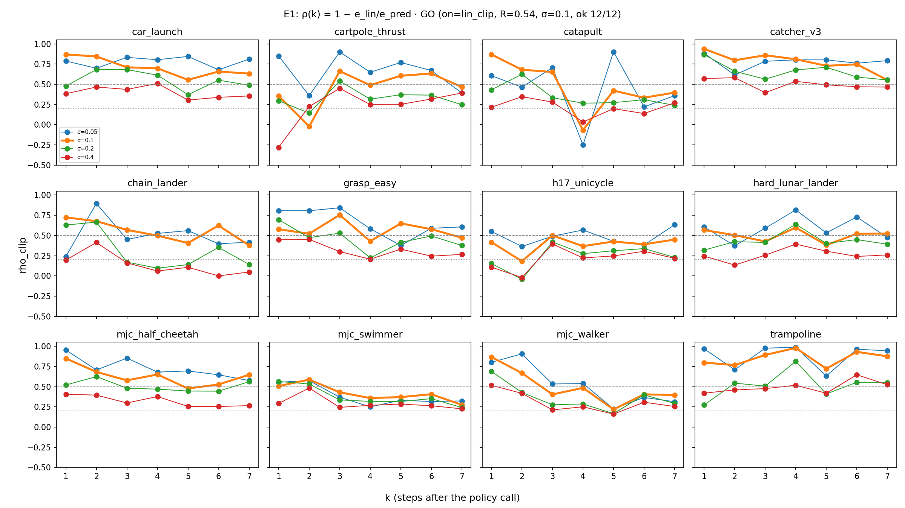
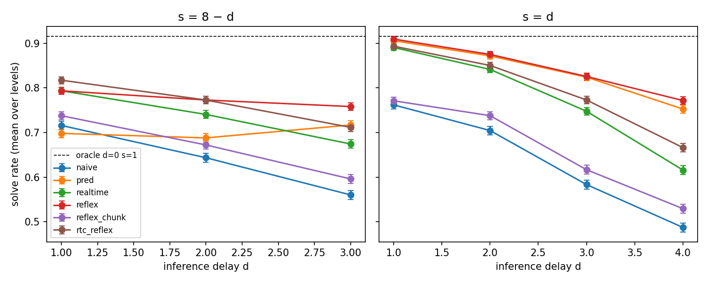
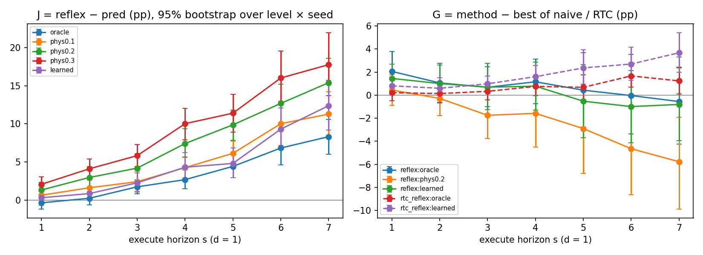

# JIT Reflex: linearizing a frozen action-chunking policy between its calls

*Aleksandr Karpov · Phase A report, with phase B1 in [§8](#8-phase-b1-stale-plans-and-imperfect-predictors), the offline part of B2 in [§9](#9-phase-b2-offline-a-cheaper-reflex-package), the B2+B5 GPU run in [§10](#10-phase-b2b5-the-cheaper-package-in-closed-loop-and-a-price-comparison), and the A2C2 rerun in [§11](#11-a2c2-reproduced-a-report-only-rerun) · Kinetix (12 levels) · September 2026. Lab notes in Russian: [E1 memo](probe.md), [E2 / Gate 2 memo](closed-loop.md), [B1 memo](b1.md), [B2 offline memo](b2-offline.md), [B2+B5 memo](b2b5.md), [A2C2 rerun memo](a2c2-fix.md), and the [design spec](../superpowers/specs/2026-09-23-jit-reflex-phase-a-design.md) with its changelog.*

## TL;DR

- **Idea.** A frozen chunking policy (flow matching, chunks of H = 8 actions) is slow to call, so between calls the robot replays a stale plan. The reflex instead acts on the policy's own **local linearization** along the predicted trajectory: `a = π(ô)[0] + clip(J·(o − ô))`. The Jacobian `J` comes from reverse-mode autodiff, and no training is involved.
- **Offline (E1).** The tangent recovers about **half** of what a fresh policy call would change, on **all 12** levels (median ρ = 0.54). This holds once actions are compared the way the environment executes them. A raw-action comparison said KILL, and we traced that to errors in clipped or unused action dimensions.
- **Closed loop (E2):** 3 seeds × 256 episodes × 12 levels on an RTX 4090.
  - With rare calls the reflex **beats Real-Time Chunking (RTC)**: +9.1 pp over delays d = 2…4, and +15.6 pp at d = 4.
  - Under random velocity kicks it beats the better of naive and RTC by **+5.3 pp**.
- **But** most of that advantage comes from **re-querying the policy at the oracle-predicted state**, not from `J`. `J`'s own niche is **rare calls**: +4…+10 pp at s ≥ 5, and +6…+8 pp under kicks. This niche was pre-registered and confirmed on held-out seeds, though only narrowly.
- **The pre-registered Gate 2 is NEGATIVE:** `J` accounted for 20% of the gain, and the bar was 50%. The pre-registered **RTC + reflex** combination also missed its bar.
- **Cost.** A reflex call is 525 network evaluations, 35× RTC, and has **2.07× RTC latency**. In the only latency-fair comparison the benchmark allows (d = 1), the reflex loses.
- **Phase B1 (§8)** replaced the oracle with wrong physics and a learned world model. The pre-registered verdict is SURVIVES, narrowly. With the learned model, reflex ≈ oracle reflex, and all of its gain over RTC appears only when `J` is switched on. Latency is still 1.8–1.9× RTC.
- **Phase B2, offline (§9).** A rule written before the data sends two shallower packages to the GPU run: `J` through only the last 3 of 5 flow steps (T3), and a 3-step flow (M3). Only T3 holds up in every check: it keeps a median 94% of the exact `J`'s offline gain and beats `pred` on all 12 levels. But it cuts depth by only 20%, so latency will likely stay around 1.5× RTC.
- **Phase B2+B5 (§10).** On the GPU, T3 keeps the exact reflex's closed-loop gain and even beats it (+1.8 pp). Its latency is 1.54× RTC, and on one GPU no reflex variant fits a latency-fair grid. When the link sets one delay for everyone, T3 beats every untrained rival by +5.6…+8.7 pp. The surprise is a report-only baseline: a small residual head **distilled from fresh calls of the policy itself** beats every `J` variant in 8 of 9 cells and dominates the latency-fair frontier. It needs training and a simulator, and it fails badly on 2 of 12 levels.
- **A2C2 reproduced (§11).** §10's A2C2 was a weak reproduction. Trained on the BC policy's own states with the paper's wider network, A2C2 becomes the strongest method in the grid. It solves about 95% in every cell and beats T3 by 14–18 pp on every level and seed. It also dominates the latency-fair frontier, the distilled head included. Its price is an expert that solves each level. `J` needs no data, training or expert, only a predictor for ô.

## 1. Hypothesis

Between two calls of a frozen chunking policy, the policy can be replaced by its own linearization along the predicted trajectory:

```
a_j = π(z_j, ô_j)[0] + clip( J_j · (o_j − ô_j), ±1 ),     J_j = ∂π(z_j, o)[0] / ∂o  at  o = ô_j
```

- `ô_j` is the observation predicted for step j at call time.
- `o_j` is the fresh observation.
- `z_j = roll(z, −j)` is the call's sampling noise, shifted so that its row 0 is the row chunk step j came from (see §3).

The idea is a "reflex": it reacts at the very next control step and needs no training. The closest prior work either trains a corrector (A2C2), uses geometric gains (Pace-and-Path), or trains a local predictor (VLA-ULAP). Taking `K` from the policy's own Jacobian was, to our knowledge, untested.

## 2. Setup and method

- **Benchmark.** [real-time-chunking-kinetix](https://github.com/Physical-Intelligence/real-time-chunking-kinetix) (Physical Intelligence): 12 Kinetix 2D-physics levels, public behavior-cloned flow policies, and Gaussian action noise σ = 0.1. The loop simulates an inference delay `d` and an execute horizon `s`. Baselines are **naive** chunking and **RTC**.
- **Predictor.** A noise-free fork of the simulator, which is an **oracle**. The plan executed over the next H steps is rolled out in this fork.
- **Per call.** The reflex computes the chunk plus, for every chunk index, `ã_j` and `J_j`. Each `J_j` takes 6 VJPs, one per action dimension, versus hundreds of JVPs for the observation dimensions.
- **Variants (ablations):**

| variant | nominal action | feedback |
|---|---|---|
| `pred` | `ã_j` | none (a training-free, oracle VLASH-like re-query) |
| `reflex` | `ã_j` | `J_j` |
| `reflex_chunk` | stale chunk action | `J_j` |
| `rtc_reflex` | RTC chunk | `J_j` |

- **Guards.** A zero-noise invariant check: `reflex_chunk` reproduces `naive` when the prediction is exact. Two bitwise checks: `reflex_off` reproduces `naive`, and `rtc_reflex_off` reproduces RTC. The upstream methods are bit-identical to Physical Intelligence's code (`scripts/check_upstream_bitwise.py`).

## 3. E1: offline kill-test (Mac CPU)

For 256 sampled states per level, a chunk is rolled out twice from each state: noise-free, giving `ô`, and with action noise σ, giving `o`. Two candidates are compared against the oracle `a* = π(z_k, o)[0]`, i.e. what a fresh call would do: the re-query `ã_k` and the tangent `ã_k + J·(o − ô)`. The statistic is `ρ = 1 − e_lin / e_pred`, the share of the "fresh call" correction that `J` recovers. It is pooled over k = 1…4 at σ = 0.1.

| run | seed | action space | median ρ (R) | levels with ρ ≥ 0.3 | verdict |
|---|---|---|---|---|---|
| E1 (pre-registered) | 0 | raw | 0.02 | 5/12 | KILL |
| sensitivity check | 0 | as executed by Kinetix | 0.53 | 12/12 | — |
| **E1b** (pre-registered after E1) | 1000 | as executed, correction clipped ±1 | **0.54** | **12/12** | **GO** |



What we learned:

1. **Compare what is executed.** Kinetix clips motors to [−1, 1] and thrusters to [0, 1], and ignores action dimensions bound to nothing. In raw space the tangent "overshot" in exactly those directions. For example, it predicted 3.0 where the truth was 1.2, but both execute as 1. On the same states, ρ moved from −2.9…0.77 in raw space to 0.34…0.82 as executed.
2. **The tangent behaves like a tangent.** ρ falls with the deviation size (0.65 / 0.54 / 0.41 / 0.31 at σ = 0.05 / 0.1 / 0.2 / 0.4) and with the step offset k. The typical sample is almost exact (median ρ ≈ 1), and the mean is dominated by rare contact events.
3. **Re-asking the policy is not the same as continuing its plan.** Even with correctly shifted noise and no disturbance, `‖A[k] − ã_k‖² ≈ 0.19`, about 5× the effect of the deviation itself. This was an early hint that the re-query alone would carry much of the benefit.

## 4. E2: closed loop (RTX 4090)

Solve rates in %, averaged over 12 levels and 3 seeds (256 episodes each). Calling the policy every step with no delay reaches 91.6%.

| d, s | naive | pred | RTC | **reflex** | `J` (reflex − pred) | reflex − RTC |
|---|---|---|---|---|---|---|
| 1, 1 | 76.2 | 90.6 | 89.1 | 90.9 | +0.4 | +1.9 |
| 1, 7 | 71.6 | 69.8 | 79.4 | 79.4 | **+9.5** | 0.0 |
| 2, 2 | 70.5 | 87.2 | 84.1 | 87.5 | +0.3 | +3.4 |
| 2, 6 | 64.4 | 68.8 | 74.1 | 77.3 | **+8.5** | +3.2 |
| 3, 3 | 58.4 | 82.4 | 74.8 | 82.6 | +0.2 | +7.8 |
| 3, 5 | 56.0 | 71.7 | 67.4 | 75.8 | **+4.1** | +8.4 |
| 4, 4 | 48.8 | 75.3 | 61.6 | 77.2 | +1.9 | **+15.6** |



**Random kicks** (d = 2; every step with p = 0.02, add N(0, (c·v_med)²) velocity to all dynamic bodies):

| c | s | naive | pred | RTC | **reflex** | `J` | reflex − max(naive, RTC) |
|---|---|---|---|---|---|---|---|
| 0.5 | 2 / 6 | 64.4 / 55.5 | 79.0 / 61.4 | 75.2 / 63.7 | 79.8 / 69.8 | +0.8 / +8.4 | +4.6 / +6.2 |
| 1 | 2 / 6 | 58.9 / 51.3 | 72.6 / 57.0 | 67.4 / 57.6 | 73.1 / 64.0 | +0.4 / +7.0 | +5.6 / +6.3 |
| 2 | 2 / 6 | 52.3 / 47.4 | 62.0 / 50.8 | 59.0 / 51.9 | 62.7 / 57.0 | +0.7 / +6.2 | +3.8 / +5.0 |

**Pre-registered decisions:**

| check | result | |
|---|---|---|
| (a) reflex beats RTC at s = 8−d, d = 2…4, by ≥ 5 pp and in every seed | +9.1 pp, 3/3 seeds | ✅ |
| (b) reflex at s = 8−d within 2 pp of RTC at s = d, i.e. ~4× fewer calls | −5.2 pp | ❌ |
| (c) under kicks, reflex beats max(naive, RTC) by ≥ 5 pp | +5.3 pp | ✅ |
| mandatory: `J` gives ≥ 50% of reflex − naive over the grid | 20% | ❌ |
| **Gate 2** | | **NEGATIVE** |
| E2c (registered on seed 0, tested on seeds 1–2): `J` gives ≥ 50% at s ≥ 5 | 0.53 and 0.57 | ✅ (narrow) |
| E2b: RTC + reflex beats RTC by ≥ 3 pp, in every seed | +2.6 pp | ❌ |

**Where it helps and where it hurts.** The reflex gains most on smooth locomotion and control levels (swimmer and walker, +21…+40 pp over RTC; cartpole; lunar lander). It loses on impact-driven and unstable levels (catapult −11…−13 pp; unicycle −18 pp at d = 2), which are the same levels with the lowest ρ in E1. `J` on top of a stale chunk (`reflex_chunk`) barely helps (+1…+4 pp over naive): the re-query and the feedback work as a pair. The same explains why RTC + reflex falls behind plain reflex.

**Cost.** Per call, the reflex costs 525 network evaluations against 15 for RTC, and 12.7× the work per episode at the (b) comparison. On an RTX 4090 at batch 1 it takes 3.42 ms against 1.65 ms for RTC, so r = 2.07. With latency counted fairly, the reflex's delay becomes `⌈2.07·d⌉`. That is feasible within H = 8 only for d = 1, and there the reflex loses: 75.8 vs 79.4 at s = 8−d, and 82.6 vs 89.1 at s = d. The re-query `pred` has r = 1.07, so its advantage at equal d is latency-fair, but it rests on the oracle predictor.

## 5. How the study was run

Every decision rule was written into the spec before its data existed, and commit timestamps show the order. When a measurement bug or a better metric appeared, the old verdict was kept and the new test was registered *before* running it, on a fresh seed:

- E1 → E1b;
- E2b before any `rtc_reflex` run;
- E2c before seeds 1–2.

Exploratory runs on the Mac (a mini-E2 and an overnight run with kicks and large delay) are labelled as such. They were used only to decide what to spend GPU money on (≈ $10).

## 6. Limitations

- **The predictor is an oracle** (a noise-free simulator fork). At large delays, most of the reflex's edge over RTC comes from knowing the future state. A real robot needs a learned predictor, and that is the main open risk. B1 (§8) tests it.
- **Kinetix is not a VLA.** Observations are symbolic, not images. There is one checkpoint set and one action-noise level.
- **E1 used one seed per run**, with 256 states × 4 draws per level.
- **The implementation over-computes.** The reflex package computes Jacobians at all 8 chunk positions, but only `s` of them are used, so the cost and latency numbers are upper bounds. B1 removed this (§8.6).

## 7. What next

Phase B is the natural next step, before any hardware (phase C). It has three parts:

1. Replace the oracle with a **learned predictor**, and check whether the re-query and `J` survive prediction error.
2. Move to a real VLA action head (π0-style action expert), where the observation Jacobian passes only through the small action expert.
3. Make the package cheap: only the `s` used positions, and a trust-region gate that falls back to re-planning near contacts, where the tangent breaks down.

The measured niche (rare calls, disturbances, smooth dynamics) says where such a reflex could pay off. Two examples: a cloud-hosted VLA called a few times per second, or a slow model on a fast, smooth manipulator.

The full agenda, with predictions and kill criteria written before any of it was run, is in [roadmap.md](../roadmap.md).

## 8. Phase B1: stale plans and imperfect predictors

*2026-09-26. The decision rules were written before the data, in the [B1 spec](../superpowers/specs/2026-09-25-b1-staleness-predictors-design.md), §5 (Russian). Russian lab note: [b1.md](b1.md). Data: `results/b1/gpu/`. The run used an RTX 4090 with seeds 10–12 × 256 episodes × 12 levels, 116 configurations.*

**Question.** In phase A, the closed-loop edge rested on an oracle predictor. B1 asks two things. Does `J`'s contribution grow as the plan gets staler? And does the effect survive when `ô` comes from an imperfect predictor?

**Predictors:**
- `oracle`: phase A's noise-free simulator fork.
- `physP`, with P = 0.1, 0.2 or 0.3: the same simulator with every mass, inertia, friction, motor and thruster parameter multiplied by 1 ± P. The sign is random for each parameter, and every method gets the same draw, so comparisons are paired.
- `learned`: a small per-level MLP world model that predicts the change in the 13–49 moving features (out of 679). It is trained on separate naive rollouts on a Mac CPU.

The step-4 prediction error was measured in units of the deviation that action noise alone produces, as a median over levels. It came out as phys0.1 1.39, phys0.2 2.15, phys0.3 3.08 and learned 3.05.

**Setup:**
- Delay d = 1 with s = 1…7, and d = 3 with s = 5.
- Methods: naive, RTC, `pred`, reflex and `rtc_reflex`. `pred` re-queries the policy at the predicted state without `J`; `rtc_reflex` adds the `J` correction to RTC's chunk.
- The package now computes only the s executed positions. This exact speedup reproduced phase A episode for episode.

**Metrics:**
- `G` is a method's solve rate minus the better of naive and RTC.
- `J` = reflex − pred is the **closed-loop ablation effect** of switching the correction on over the re-query. It is not a share of the success.
- Brackets give 95% bootstrap intervals over the 36 level × seed cells, because episodes within a cell are not independent. The intervals are for reporting only; the decision rules do not use them.

### 8.1 Verdict

The verdict is decided on two rare-call slices: D1 (d = 1, s = 5–7) and D3 (d = 3, s = 5). A predictor PASSes a slice if reflex or `rtc_reflex` gets a pooled `G` of at least +1 pp and is above 0 in every seed.

| pre-registered rule | result | |
|---|---|---|
| R1: does the effect survive 20% physics error? | D3: reflex +3.3 pp, all 3 seeds > 0 → PASS; D1: FAIL | **SURVIVES** |
| R2: does `J` grow with staleness? (oracle; mean over s ≥ 5 minus mean over s ≤ 3) | +6.0 pp, > 0 in every seed | confirmed |
| R3: does `J` grow with prediction error? (phys0.2 minus oracle, mean over s) | +4.3 pp, > 0 in every seed | confirmed |
| R4: is the learned model good enough? (same slice test as R1) | PASS on both slices | **ENOUGH** |
| prediction: `rtc_reflex` degrades more than reflex under prediction error | the opposite | not borne out |

**Caveat.** SURVIVES follows the written rule, but only barely. The interval for that D3 phys0.2 gain is +3.3 (−1.9, +8.6), so it contains zero once variation across levels is counted.

### 8.2 Slices

| slice | predictor | reflex `G` | `rtc_reflex` `G` | status |
|---|---|---|---|---|
| d = 1, s = 5…7 | oracle | −0.1 (−3.3, +3.3) | **+1.2 (+0.4, +2.0)** | PASS |
| | phys0.2 | −4.4 (−8.2, −0.9) | −0.1 (−1.4, +1.2) | FAIL |
| | learned | −0.8 (−3.8, +2.2) | **+2.9 (+1.6, +4.4)** | PASS |
| d = 3, s = 5 | oracle | **+9.3 (+4.1, +14.6)** | +3.8 (+1.2, +6.5) | PASS |
| | phys0.2 | **+3.3 (−1.9, +8.6)** | +0.4 (−3.1, +4.1) | PASS |
| | learned | **+7.7 (+3.2, +12.6)** | +6.1 (+3.1, +9.5) | PASS |

- **d = 3 reproduces phase A on fresh seeds.** Reflex, RTC and `pred` solve 76.7, 67.4 and 71.1%; phase A had 75.8, 67.4 and 71.7%.
- **At d = 1 the reflex does not beat RTC, even with the oracle:** −0.1 (−3.3, +3.3). Only `rtc_reflex` keeps a small, consistent edge. When calls are frequent, RTC already does almost everything.

### 8.3 A learned world model plus `J` is close to the oracle

This table gives learned model minus oracle, for the same method:

| where | `pred` (no `J`) | reflex (with `J`) | `rtc_reflex` |
|---|---|---|---|
| d = 1, s = 7 | −4.3 (−6.9, −2.0) | **−0.2 (−1.6, +1.2)** | +2.4 (+1.1, +3.8) |
| D1 slice | −3.0 (−4.8, −1.3) | **−0.7 (−1.6, +0.2)** | +1.7 (+0.9, +2.6) |
| D3 slice | −3.6 (−6.5, −0.9) | **−1.5 (−3.5, +0.2)** | +2.4 (+1.0, +3.9) |

Re-querying at the model's predicted state is 3–4 pp worse than at the oracle's, and the intervals exclude zero. With `J` switched on, the gap shrinks: from 4.3 to 0.2 pp at d = 1, s = 7, and from 3.6 to 1.5 pp on D3. Those intervals include zero.

### 8.4 Ablation: where the gain comes from

- **D3 with the learned model:** `pred` has `G` = 0.0 (−3.7, +4.0), while reflex has +7.7 (+3.2, +12.6). With a learned predictor, **all of the gain over RTC appears only when `J` is switched on**.
- **D3 with the oracle:** `pred` has +3.6 (−0.7, +8.1) and reflex +9.3. With a perfect prediction the re-query helps on its own; with a realistic one it does not.

The next table shows the closed-loop ablation effect of `J` (reflex − pred) at d = 1, in pp. The last two columns carry intervals.

| predictor \ s | 1 | 2 | 3 | 4 | 5 | 6 | 7 | s = 7 interval | D1 slice |
|---|---|---|---|---|---|---|---|---|---|
| oracle | −0.4 | 0.2 | 1.7 | 2.7 | 4.4 | 6.8 | 8.3 | (6.0, 10.6) | 6.5 (4.8, 8.2) |
| phys0.1 | 0.6 | 1.6 | 2.4 | 4.3 | 6.1 | 10.0 | 11.3 | (8.3, 14.2) | 9.1 (6.9, 11.3) |
| phys0.2 | 1.3 | 3.0 | 4.2 | 7.4 | 9.9 | 12.7 | 15.4 | (12.3, 18.6) | 12.6 (10.2, 14.9) |
| phys0.3 | 2.1 | 4.1 | 5.8 | 10.0 | 11.4 | 16.0 | 17.8 | (13.7, 22.0) | 15.0 (11.8, 18.3) |
| learned | 0.3 | 0.9 | 2.3 | 4.3 | 4.8 | 9.3 | 12.4 | (9.2, 15.7) | 8.8 (6.5, 11.3) |

- **Across a row**, the effect grows with staleness (R2): it is near zero at s = 1 and well clear of zero at s = 7.
- **Down a column**, it grows with physics error (R3), a dose–response pattern. So the correction repairs prediction error as well as action noise.
- **But the re-query loses more than `J` restores.** At s = 7, `pred` falls from 70.4% with the oracle to 58.1% with phys0.2; reflex falls only from 78.7% to 73.5%.



### 8.5 The `rtc_reflex` prediction, and an open puzzle

- **Pre-registered reasoning.** Reflex cancels prediction error to first order, since `π(ô) + J·(o − ô) ≈ π(o)`. In `rtc_reflex`, a wrong `ô` adds a spurious correction. So `rtc_reflex` should degrade more.
- **Observed.** From oracle to phys0.2, reflex lost 4.4 pp on D1 and 6.0 pp on D3; `rtc_reflex` lost only 1.3 and 3.4 pp. One candidate explanation, not yet tested: at 2–3 noise units of error the linearization step is too long, so the nominal `π(ô)` drifts more than `J` brings back. This fits E1, where ρ fell with the deviation size. `rtc_reflex`'s nominal action does not depend on `ô`, and its spurious correction is clipped at ±1.
- **Puzzle.** `rtc_reflex` does *better* with the learned model than with the oracle: +1.7 (+0.9, +2.6) on D1 and +2.4 (+1.0, +3.9) on D3. The intervals exclude zero, so this is not noise, and we have no explanation yet. The best d = 1 configuration with rare calls is `rtc_reflex` with the learned model: 82.9% at s = 7 against RTC's 79.3%, `G` = +3.7 (+2.0, +5.4). This is exploratory and needs fresh seeds.
- **Wrong error scale.** By the norm of the observation error, the learned model is as wrong as phys0.3, yet in closed loop it behaves almost like the oracle. An offline diagnostic comes next and should settle both questions. It will measure ‖J·e‖, the cosine between `J·e` and the correction actually needed, the share of the error along `J`'s top singular directions, the linearization residual and the clip rate.

### 8.6 Cost

On the RTX 4090 at batch 1 with d = 1:
- Reflex latency is r = 1.84 / 1.78 / 1.89 × RTC at s = 1 / 4 / 7, with 70 / 265 / 460 network evaluations per call. Phase A had r = 2.07.
- `rtc_reflex` has r = 2.13–2.26, and `pred` has 1.06–1.19.

The exact speedup removed network evaluations but barely moved latency. Latency is set by **depth**, the sequential flow steps plus the backward pass, not by the number of evaluations, so B2 has to cut depth. The GPU run took 11.6 h (about $9), roughly 40% of it JIT compilation.

### 8.7 Caveats

- **The verdict rests on little.** SURVIVES comes from one slice and one method, and at the level × seed scale that margin cannot be told apart from zero.
- **At d = 1 the reflex ≈ RTC,** even with the oracle.
- **Latency is still 1.8–1.9× RTC,** so the latency-fair comparison still goes against the method.
- **"Wrong physics" is artificial error:** random parameter multipliers. A real model errs differently (§8.5).
- **The world model was trained on the same levels.** Transfer to new levels was not tested.
- **Other regimes were not tested:** observations are symbolic, there are no kicks, and only d = 1 and d = 3 were run.

### 8.8 Offline diagnostic (exploratory)

To explain §8.5, E1b was rerun offline on fresh seeds with every predictor ([spec](../superpowers/specs/2026-09-26-b1-diagnostic-design.md), [Russian note](b1-diag.md), data in `results/b1/diag/`). The plan was chained over four chunks, so k runs up to 31. As a check, the oracle reproduces E1b: ρ_clip = 0.58 at k = 1–4, against 0.54.

- **Why the learned model hurts less than wrong physics.**
  - Per unit of observation error, `J` sees less of the learned model's error: ‖J·(o* − ô)‖ / ‖o* − ô‖ = 0.13, against 0.16–0.18 for wrong physics, lower on 11 of 12 levels.
  - Half as much of it lies along `J`'s top direction.
  - So the policy's action at the learned prediction is closer to a fresh call. At about the same error norm, the action error left after the correction is 0.050, against 0.075 for phys0.2.
  - `J` does not recover a larger fraction: ρ_clip is 0.34 against 0.38 for phys0.2. There is simply less to correct.
- **The `rtc_reflex` puzzle is only partly explained.** Offline, the learned model's correction on top of the plan's own action is slightly better than the oracle's on the median, but only on 4 of 12 levels. Three of them (walker, swimmer, catapult) are among the levels that carried the effect in closed loop. It becomes a hypothesis for B2+B5, stated before the data.
- **Where the tangent breaks.**
  - The quality of the tangent depends on the size of the deviation alone: one curve fits every predictor.
  - ρ_clip falls from 0.79 at ‖e‖ < 0.17 to 0.3 at ‖e‖ ≈ 2.3 and to 0.06 beyond 7. Its median never turns negative, except for the learned model in the last bin (‖e‖ > 7: −0.02). Units are normalized; action noise alone gives about 0.55 by k = 4.
  - In open loop, the oracle's median ρ_clip stays above 0.3 for 15–19 steps. The realistic predictors cross it after 4–14 steps, depending on the predictor and the set of levels. These are first crossings of noisy, non-monotonic curves, so they are rough.
  - On long horizons, then, the limit is how fast the prediction error grows, not the tangent itself.
  - This curve sets the trust-region thresholds for B3.

### 8.9 Next

Spec §5 maps SURVIVES with R4 = ENOUGH to B2, a cheaper package used with the learned model. The offline diagnostic (§8.8) is done. B2's offline selection is done (§9).

## 9. Phase B2, offline: a cheaper reflex package

B1 showed that a reflex call's latency is set by its depth, not by the number of network evaluations. After the exact speedup a call still costs 1.8–1.9× RTC, and most of the extra is the backward pass through all five flow steps. B2 looks for a shallower package. Candidates were scored offline, as in E1b and §8.8. A rule written before the data picks the ones that go to a single GPU run for B2 and B5 ([spec](../superpowers/specs/2026-09-26-b2-offline-design.md), [Russian memo](b2-offline.md), data in `results/b2/offline/`).

**Candidates.** Depth counts the sequential flow steps after the chunk and the predictor, with forward and backward steps counted as 1 each. The exact reflex has depth 10 and `pred` has depth 5.
- **T_k:** the exact 5-step forward pass at ô, with `J` taken through the last k steps only. The nominal action is exact. Depth 5 + k.
- **W_k:** a warm start that runs only the last k steps at ô, starting from the chunk's own intermediate state. Depth 2k.
- **M_m:** an m-step flow from the same noise. Depth 2m.
- **Width rows:** one `J` shared across all positions, and `J` on the bound action dimensions only. The latter is exact by construction, so it was not scored.

**Yardstick and rule.**
- **Yardstick:** the residual against a fresh call, ‖exec(a*) − exec(nom + clip(J·e))‖², in the ‖e‖ bins of §8.8.
- **Summary score:** R, the share of the exact `J`'s gain over `pred` that a candidate keeps. It is computed per level from pairs with ‖e‖ ≤ 2.3 and k ≤ 7, then the median is taken over levels.
- **Pass:** a median R ≥ 0.8, and beating `pred` on at least 10 of 12 levels.
- **GPU run:** the shallowest passer, the best passing T_k, and the shallowest candidate with R ≥ 0.9.

**Checks.** The first run, with 128 states per level, failed the oracle sanity check: ρ_clip at k = 1–4 was 0.40, against 0.578 ± 0.1.
- **Cause:** before reading anything else, we traced the failure to state sampling, not code. A bootstrap over states gave (0.37, 0.59). The diagnostic's own code, run on the same states, gave similarly low values.
- **Repeat:** the run was repeated with 512 states per level, and the first run was never read. The repeat passed, at the edge: 0.478.
- **Code check:** on shared states, flow noise and action noise, the exact reflex in the B2 code matches the diagnostic's code bit for bit.

| package | R | levels beating `pred` | R without the heaviest 5% of states | R with the oracle | depth | forward evals |
|---|---|---|---|---|---|---|
| exact reflex | 1 | 12 | 1 | 1 | 10 | 330 |
| **T3** | **0.94** | **12** | **0.97** | **0.90** | 8 | 210 |
| T2 | 0.71 | 12 | 0.76 | 0.66 | 7 | 150 |
| T1 | 0.29 | 12 | 0.30 | 0.25 | 6 | 90 |
| **M3** | 0.85 | 11 | 0.75 (9 levels) | 0.59 | 6 | 200 |
| W3 | 0.80 | 10 | 0.35 (7 levels) | −0.11 | 6 | 200 |
| M1 / W1 | −5.8 / −0.96 | 1 / 2 | — | — | 2 | 70 |
| one shared `J` | −0.11 | 5 | −0.23 | 0.05 | 10 | 90 |

- **The rule passes T3, M3 and W3, and sends M3 and T3 to the GPU run.** M3 ties W3 on depth and cost and wins on R. T3 is the best T_k and the only candidate with R ≥ 0.9.
- **Only T3 is robust.** It keeps 94% of the gain on 12 of 12 levels, 97% without the heaviest 5% of states, and 90% with the oracle. At every chunk index R is 0.89–0.97, and on 4 levels it is as good as or better than the exact `J`.
- **M3 and W3 pass on the mid-size and large deviations.**
  - Their nominal action is not π(ô). At small ‖e‖ their residual is 9–18× the exact reflex's, and higher than `pred`'s.
  - They fail without the heavy states and with the oracle, whose small prediction error leaves that floor exposed.
  - M3 fails mostly at k = 1–2 (R 0.44, 0.63). At the positions executed at d = 3 (k = 3–7) its R is 0.86–1.03.
- **Sharing one `J` across positions is worse than using no `J`.**

**Cost.** T3 cuts depth by only 20% (from 10 to 8), and M3 by 40%.
- **Latency estimate,** interpolated from B1's timings ([cost.txt](../../results/b1/gpu/cost.txt): RTX 4090, batch 1, d = 1, s = 1, 4, 7):
  - T3 keeps 3 of the exact reflex's 5 backward steps: r_T3 ≈ r_pred + 3/5·(r_reflex − r_pred) ≈ 1.5–1.6.
  - M3 also runs 2 fewer forward steps: r_M3 ≈ r_T3 − 2/5·(r_pred − r_naive) ≈ 1.3–1.4.

  Both are above the 1.2 target. The GPU run will measure the real values.
- **Consequence:** a latency-fair grid at d = 3 needs r ≤ 4/3 ≈ 1.33. Then d′ = ⌈r·3⌉ = 4, and s = 4 satisfies s ≥ d′ and s + d′ ≤ 8.
  - At T3's r ≈ 1.5 the grid is impossible, and a latency-fair comparison remains only at d ≤ 2, where the reflex gains little.
  - M3 sits at that edge, and at the positions executed at d = 3 its R is 0.86–1.03. Its measured latency will decide whether a latency-fair grid at d = 3 is possible at all.

**Next.** One GPU run for B2+B5 with T3, M3, the exact reflex, `pred`, `rtc_reflex`, RTC, naive and A2C2, the trained residual corrector that is B5's mandatory baseline (B4 in the [roadmap](../roadmap.md)).
- **First question:** taking `J` off the critical path. Execution would start on `pred`'s nominal (r ≈ 1.1), and the correction would switch on at the positions `J` has reached by then.
- **Prediction, stated before the data:** at d = 3, M3 is close to T3; at d = 1, it is clearly worse.

## 10. Phase B2+B5: the cheaper package in closed loop, and a price comparison

One run on an RTX 4090 answered two questions. B2 asks whether the shallower packages of §9 keep the exact reflex's closed-loop gain. B5 asks whether a rare call plus a cheap reflex pays off when every method pays its own latency and compute. The rules were written before the data ([spec](../superpowers/specs/2026-09-26-b2b5-gpu-design.md), [Russian memo](b2b5.md), data in `results/b2b5/`).

- **Scale:** 135 configurations × seeds 20–22 × 12 levels × 256 episodes. The grid took 5.5 h. No configuration is missing, and no rule came out GRAY, so the seed extension was not needed.
- **Methods:**
  - naive; RTC with 5 and with 10 flow steps; `pred`;
  - the exact reflex, T3 and M3, all with the learned world model;
  - late `J`: `pred`'s nominal action, with `J` switched on δ positions late, so that `J` can be computed alongside the next call;
  - `rtc_reflex`;
  - two trained residual heads, report-only. **A2C2** is the bt-kinetix variant (MIT), trained on PPO expert data. **A2C2-distill** is the same head trained to match fresh calls of the policy itself, on 1M of its own transitions.
- **Latency** was measured per cell on the pod, including the world model's rollout. A method with latency ratio r runs at delay d′ = ⌈r·d⌉, where the base delay d is RTC's.

| rule (written before the data) | verdict | pooled, pp | per seed | 95% CI (report only) |
|---|---|---|---|---|
| B2-R1: T3 − exact reflex, d = 3, s = 5 | **KEEPS** | +1.84 | + + + | 0.63…3.06 |
| B2-R1: M3 − exact reflex, d = 3, s = 5 | **KEEPS** | +1.69 | + + + | 0.24…3.22 |
| B5-R1: late `J` at honest latency, base d = 3 | **NOT FEASIBLE** | — | | |
| B5-R2: M3 at honest latency, base d = 3 | **NOT FEASIBLE** | — | | |
| B5-R3: T3 − best of naive, RTC, RTC-10 and `pred` at the same delay; (3,5) | **PASS** | +8.68 | + + + | 4.08…13.44 |
| B5-R3: the same at (4,4) | **PASS** | +5.59 | + + + | 3.48…8.01 |
| report only: B5-R1 with a second device, late `J` at (4,4) | WIN by the rule, **weak** | +1.49 | + + + | −1.86…4.76 |

- **The cheaper package keeps the exact reflex's gain, and beats it.** T3 is ahead in all 9 cells, and at d = 3 the interval excludes zero. But B2's latency goal (r ≤ 1.2) is missed: T3's r is 1.54 and M3's is 1.38.
- **On one GPU the reflex does not fit a latency-fair grid.**
  - Computing `J` concurrently slows the next call 2.15×, because JAX runs one queue per device. Late `J` would therefore need d′ = 7.
  - M3 misses d′ = 4 by 3.8%.
  - With a second device, late `J` wins by the rule, but its interval contains zero. That result is weak and report-only.
- **When the link sets the delay** (one d for everyone), T3 is well ahead of every untrained rival: +8.7 pp at (3,5) and +5.6 pp at (4,4). RTC with 10 flow steps is worse than with 5 in all 9 cells.
- **B1's exploratory finding replicates on fresh seeds.** `rtc_reflex` with the learned model beats RTC by +2.1, +2.9 and +3.5 pp at d = 1 and s = 5, 6, 7, and by +5.5 pp at (3,5), on every seed. Its r ≈ 2.2, so this too only holds when the link sets the delay.
- **Predictions stated before the data.**
  - Held: late `J` beats `pred` at (4,4) by +4.2 pp; the latency estimates of §9 were right; and `rtc_reflex` is better with the learned model than with the oracle, with 81–85% of that gain on the four levels named in advance.
  - Failed: M3 is not worse than T3 at d = 1 (+0.1 pp).
- **Closed-loop ‖e‖.** 19–44% of executed steps have ‖e‖ > 2.3. There §8.8's tangent recovers a small but positive share of the needed correction (median ρ_clip 0.18–0.25). Applied at every step, those small corrections add up to `J`'s +7.5 pp over `pred` at (3,5), which is consistent with the diagnostic.

**The surprise: the distilled head (report only, not a rule).** Solve rate in %; D1 is the mean over s = 5, 6, 7:

| cell | naive | RTC | `pred` | exact reflex | T3 | A2C2 | A2C2-distill |
|---|---|---|---|---|---|---|---|
| D1 | 73.8 | 81.2 | 72.3 | 80.9 | 81.3 | 76.4 | **85.9** |
| (2,2) | 71.2 | 84.2 | 86.0 | 87.0 | **87.3** | 76.3 | 85.2 |
| (2,6) | 63.7 | 73.9 | 64.7 | 77.0 | 77.9 | 76.2 | **85.3** |
| (3,5) | 55.7 | 68.0 | 67.4 | 74.9 | 76.7 | 75.8 | **81.4** |
| (4,4) | 48.6 | 61.4 | 72.1 | 76.4 | 77.7 | 76.6 | **80.3** |

- **It beats T3 in 8 of 9 cells, but not on every level.**
  - The pooled gap is +4.7 pp at D1 and (3,5) and +2.7 pp at (4,4), positive on every seed. The level × seed intervals still include zero.
  - It wins big on catapult (+40 pp at (3,5)), h17_unicycle (+27), catcher_v3 (+22), car_launch (+19) and mjc_swimmer (+11).
  - It collapses on grasp_easy (−37, below its own naive chunk) and mjc_walker (−32).
- **Against RTC the intervals exclude zero:** +4.8 pp at D1, +13.4 at (3,5), +18.9 at (4,4).
- **The gap to T3 grows with the execute horizon s, not with d.** The head sees the real observation at every step, while T3's nominal action and `J` rest on a world-model forecast d + s − 1 steps long.
- **It dominates the latency-fair frontier among §10's methods** (§11's fixed A2C2 dominates it in turn). It runs on naive's cheap chunk, plus a 0.07 ms head per step on the CPU. At base d = 2–4 only naive and the distilled head are non-dominated in GPU-ms per step. At base d = 3 it solves 86.2% at 0.44 GPU-ms per step, against RTC's 74.8% at 0.60.
- **Its price is training.** It needs 1M simulator transitions and 0.36 PFLOP per level, about 28× the world model's training compute. It was also trained with 2–11% fewer steps than the protocol asked for, which works against it.
- **It is exploratory.** B5's rules only counted untrained methods as rivals, so this result needs its own test with a rule written in advance.

**A2C2, the bt-kinetix variant.** This row is kept as run. §11 reproduces A2C2 properly and supersedes it as the A2C2 baseline.
- **Its profile is flat:** 75.8–76.8% in every cell, whatever the delay. It is below RTC at d = 1 (−4.8 pp) and above it at d = 4 (+15.2).
- **The mean hides extremes.** A2C2 solves at least 91% on 8 levels, but only 0–7% on mjc_walker and trampoline, where its naive base chunk solves 39% and 82% at d = 1.
- **The paper's scale is visible on 10 of 12 levels.** Without those two levels A2C2 is +28.5 pp over RTC at d = 4. The paper reports +23 over RTC on Kinetix, and we did not reproduce its settings.
- **The collapse does not come from our evaluation code.** The distilled head runs through the same path and solves trampoline 62–90%.
  - What differs is the training target: the expert's actions.
  - Our variant has the same inputs as the paper's Kinetix head: the paper uses base-policy features only on LIBERO. It differs in the network (256 → 512 without LayerNorm, against three layers of 512 with LayerNorm) and in the observation (679 rather than 2722 dimensions), and it sits on a naive chunk rather than RTC's. (Corrected on 2026-09-28: an earlier version said our variant lacked policy features that the paper uses.)
- **It does not beat T3** (−0.9 pp at (3,5)), contrary to the prediction.

**Caveats.**
- The concurrency cost κ is specific to one GPU and JAX's single queue.
- Both heads are report-only, and there is one distillation recipe, fixed in advance.
- A2C2 is the bt-kinetix variant: the paper's Kinetix inputs, but a different network and observation size. It was not checked on held-out data.
- The world models are the Mac-trained ones of §9.

**Next,** to be discussed separately: the literature on distilling re-queries, and a `J` + distillation hybrid. The two fail on opposite levels. The distilled head fails on grasp_easy and mjc_walker, where T3 is strong. T3 is weak on catapult, h17_unicycle and catcher_v3, where the head is strong.

## 11. A2C2 reproduced: a report-only rerun

The bt-kinetix A2C2 of §10 collapsed on two levels. Exploratory checks on the Mac found why ([Russian note](b2b5-checks.md), checks (а)–(а3)). A short pod rerun of A2C2 alone followed, with a spec written before the data ([spec](../superpowers/specs/2026-09-28-a2c2-fix-design.md), [Russian memo](a2c2-fix.md), data and head weights in `results/b2b5_fix/`). It is a baseline for the report, not a rule, and §10's A2C2 row stays as run.

- **Data and labels, shared by both variants.** Each level gets 262,144 transitions of the BC policy itself (naive at d = 0, s = 8). Each transition is labelled with the action mode of one PPO expert per level. The expert was chosen in advance from its training statistics.
- **Two heads:**
  - **`a2c2_paper`**, the paper's head as written: two hidden layers of 512 with LayerNorm, on the expert's observation (4 frames plus the last action, 2722 dimensions);
  - **`a2c2_wide`**, the same network on one frame (679 dimensions), the input of §10's A2C2 and of the distilled head. It was chosen by an exploratory check on **one level**.
- **Scale:** 2 heads × 16 cells × seeds 20–22 × 12 levels × 256 episodes. Training the 24 heads took 29 min and the grid 35 min.
- **Checks:**
  - no configuration is missing, and the archive's manifest and the heads' SHA-256 lock were verified on the Mac;
  - every head's held-out error is below the uncorrected chunk's on all 12 levels;
  - a zero head reproduces naive bit for bit.
- **Development levels.** The variants were chosen on trampoline, mjc_walker and car_launch. The table gives every row for all 12 levels and for the other 9.

Differences in pp at D1 / (3,5) / (4,4). Every row has the same sign on all three seeds.

| row | all 12 levels | 9 levels, development excluded |
|---|---|---|
| `a2c2_paper` − T3 | +14.3 / +18.5 / +17.1 | +13.5 / +16.2 / +14.4 |
| `a2c2_paper` − RTC | +14.4 / +27.2 / +33.3 | +11.5 / +26.1 / +32.5 |
| `a2c2_paper` − A2C2-distill *(unequal: input and network)* | +9.6 / +13.8 / +14.4 | +6.1 / +8.9 / +9.4 |
| `a2c2_paper` − §10's A2C2 | +19.2 / +19.4 / +18.1 | +5.3 / +5.5 / +4.2 |
| `a2c2_wide` − T3 | +11.7 / +16.0 / +15.5 | +10.6 / +13.5 / +12.7 |
| `a2c2_wide` − A2C2-distill *(unequal: network and teacher)* | +7.1 / +11.2 / +12.9 | +3.3 / +6.3 / +7.7 |
| `a2c2_wide` − `a2c2_paper` | −2.6 / −2.5 / −1.5 | −2.8 / −2.7 / −1.7 |

All level × seed intervals exclude zero except one: `a2c2_wide` − A2C2-distill at D1 on the 9 levels, −0.04…6.99.

- **The fixed A2C2 is the strongest method in the grid.**
  - `a2c2_paper` solves 94.7–95.8% in every cell, at any delay.
  - It is ahead of T3 and RTC on every one of the 12 levels.
  - On the latency-fair frontier, at every base delay, only naive and the two new heads are non-dominated. RTC (1,1), §10's best configuration, and the distilled head are now dominated.
- **The paper's scale is reached.** At (4,4) our naive (48.6%) and RTC (61.4%) are close to the paper's 51.2 and 62.9. `a2c2_paper` solves 94.7%, +33.3 pp over RTC, against the paper's +23.6. The settings differ: our data are labelled BC rollouts, not a demonstration dataset.
- **What broke, and what fixes it** (exploratory, 64 environments, one cell):
  - the narrow network: on trampoline the wider one lifts a one-frame head from 0.08 to 1.00;
  - training on the expert's states: on mjc_walker, labelling the BC policy's own states lifts the old network from 0.03 to 0.77;
  - mixing experts was not the cause, and frame history adds only about 2.5 pp on the full grid.
- **Offline error does not predict the closed loop.** On trampoline, four heads with held-out MSE 0.002–0.007 solve between 0.08 and 1.00.
- **The paper's parameter count is inconsistent with its text.** 0.31M is exactly the bt-kinetix head on one frame (310,790). The network as written has 1,666,054 parameters on the 2722-dimensional input and 620,038 on one frame. We ran both readings.
- **The comparison with the distilled head is unequal.** `a2c2_wide` shares its input, but it differs in the network, the teacher (an expert versus a fresh call of the policy) and the data (262k transitions against 1M). A distilled head with the same network is left for future work.
- **Where `J` stands.**
  - `J` itself needs no data, no training and no expert, and works at once.
  - The reflex also needs a prediction ô. Here that is a world model trained on 32,768 transitions (13 TFLOP per level): 8–9× fewer transitions than the fixed A2C2, and no expert.
  - The fixed A2C2 needs an expert that solves each level (its PPO training is not counted), plus 262k labelled transitions and 25–50 TFLOP per level.
  - Among rivals without a trained head, T3 stays ahead (B5-R3).
- **Caveats.**
  - Report only.
  - The variants were not chosen blind, hence the development split.
  - One expert per level.
  - d ≤ 4, H = 8, three seeds, and a naive chunk under the head.
